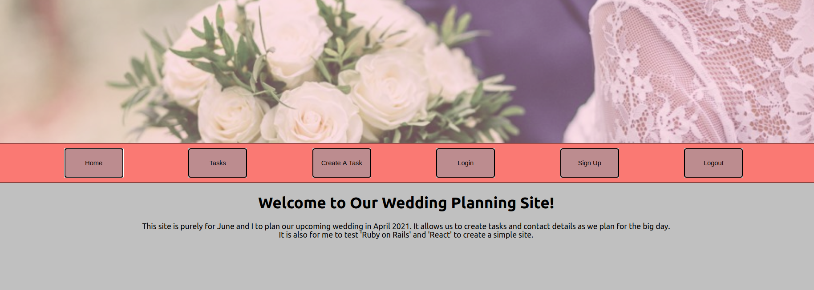
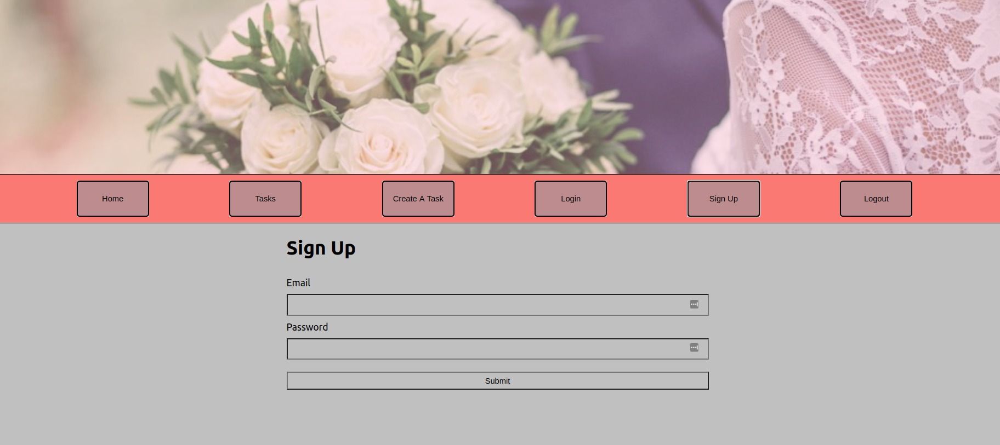
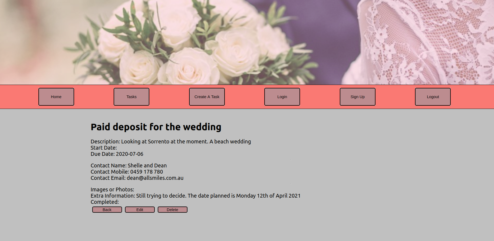
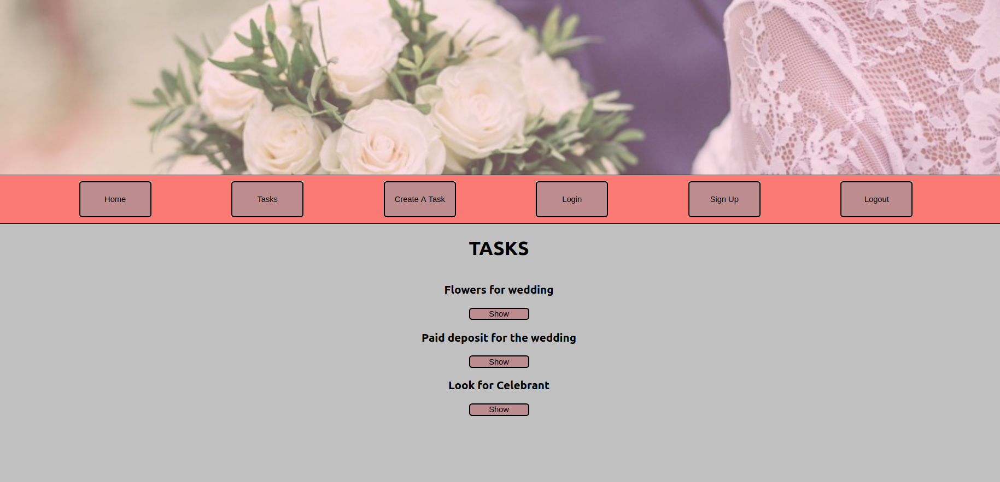

# Our_Big_Day

Our wedding day is coming up fast - Next April in fact. So I wanted to create a small Rails and React app

# Front End

Javascript and React

# Back End

Ruby on Rails and Postgresql database

# Theme

A simple To-do / Task management app. Because I am getting married next April, I wanted to create an app that would help my fiancée and myself in task management.

# Purpose / Learning Outcomes

I wanted to create a simple weekend project where I can test Rails and React together. Using Rails as the backend with Postgresql as the database, and JavaScript and React as the front end.

Another learning outcome was getting the Rails server to work on my laptop (ubuntu) and connect the front end React from my Desktop (windows 10), while on the same network.

# Functionality and Features

Currently it's a very simple interface with a single form entry that stores to the backend database. Eventually I want to include separate tabs ie (photography services, florist information, guests invited and contact details, invitation stock)

# Screenshots

# To do

A project is never really finished is it? Ideally, add a couple more sections such as contacts page and a more robust system overall. Currently anyone can sign up and see our tasks, so need to add references to that.
